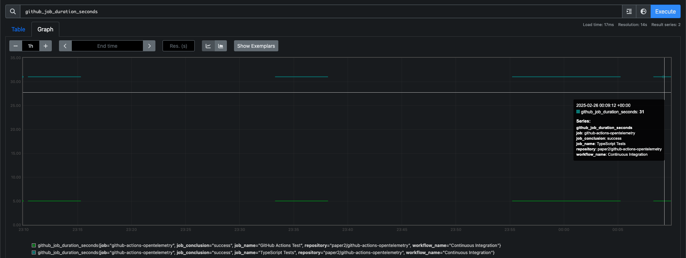

# GitHub Actions OpenTelemetry


[](https://github.com/actions/typescript-action/actions/workflows/check-dist.yml)
[](https://github.com/actions/typescript-action/actions/workflows/codeql-analysis.yml)
[](./badges/coverage.svg)

This action sends metrics and traces of GitHub Actions to an OpenTelemetry
Protocol (OTLP) endpoint. It helps you monitor and analyze GitHub Actions.

## Features Summary

- 📊 Collects Metrics of GitHub Actions workflows and job execution times
- 🔍 Collects Traces of GitHub Actions workflow, jobs, steps.
- 📦 Sends data to any OTLP-compatible backend for monitoring and observability
- 🚀 Easy integration with GitHub workflows

## Metrics

| Descriptor Name              | Description            |
| ---------------------------- | ---------------------- |
| `github.workflow.duration`   | Duration of workflow   |
| `github.job.duration`        | Duration of job        |
| `github.job.queued_duration` | Duration of queued job |

Each metric has associated attributes.



## Traces


## How it works

This action creates metrics and traces of GitHub Actions workflows and sends
them to an OTLP endpoint. It uses the GitHub API to collect data about completed
workflows and jobs. The action then sends this data to the OTLP endpoint for
monitoring and observability.

```mermaid
sequenceDiagram
  participant TW as Target Workflow
  participant GAOW as GitHub Actions OpenTelemetry Workflow
  participant GA as GitHub API
  participant OE as OTLP Endpoint

  TW ->> TW: Complete Workflow
  TW ->> GAOW: Trigger by workflow_run
  GAOW ->> GA: Get Target Workflow Data
  GAOW ->> OE: Send Metrics and Traces
```

## Setup Instructions

1. **Create OTLP Endpoint**: Set up an OTLP backend to receive telemetry data
   (e.g., Jaeger, Prometheus, or other monitoring tools).
1. **Add a Workflow**: Create a new workflow file and use this action triggered
   by
   [workflow_run](https://docs.github.com/en/actions/writing-workflows/choosing-when-your-workflow-runs/events-that-trigger-workflows#workflow_run)
   because this action collects telemetry of completed workflows.

### GitHub Actions Example

Here's an example of how to set up this action in a GitHub Actions workflow:

```yaml
name: Send Telemetry after Other Workflow

on:
  workflow_run:
    # Specify the workflows you want to collect telemetry.
    workflows:
      - Check Transpiled JavaScript
      - Continuous Integration
      - CodeQL
      - Lint Codebase
    # This action uses completed workflow for making traces and metrics.
    types:
      - completed

permissions:
  # Required for private repositories
  actions: read

jobs:
  send-telemetry:
    name: Send CI Telemetry
    runs-on: ubuntu-latest
    steps:
      - name: Run
        id: run
        uses: paper2/github-actions-opentelemetry@main
        env:
          OTEL_SERVICE_NAME: github-actions-opentelemetry
          OTEL_EXPORTER_OTLP_ENDPOINT: https://collector-example.com
          # Additional OTLP headers. Useful for OTLP authentication.
          # e.g.
          # New Relic: api-key=YOUR_NEWRELIC_API_KEY
          # Google Cloud Run: Authorization=Bearer <value of $(gcloud auth print-identity-token)>
          OTEL_EXPORTER_OTLP_HEADERS:
            api-key=${ secrets.API_KEY },other-config-value=value
        with:
          # Required for collecting workflow data
          GITHUB_TOKEN: ${{ secrets.GITHUB_TOKEN }}
```

### Configuration

To configure the action, you need to set the following environment variables:

| Environment Variable                  | Required | Default Value | Description                                                                                      |
| ------------------------------------- | -------- | ------------- | ------------------------------------------------------------------------------------------------ |
| `OTEL_SERVICE_NAME`                   | Yes      | -             | Service name.                                                                                    |
| `OTEL_EXPORTER_OTLP_ENDPOINT`         | Yes      | -             | OTLP Endpoint for Traces and Metrics. e.g., <https://collector-example.com>                      |
| `OTEL_EXPORTER_OTLP_METRICS_ENDPOINT` | No       | -             | OTLP Endpoint for Metrics instead of OTEL_EXPORTER_OTLP_ENDPOINT.                                |
| `OTEL_EXPORTER_OTLP_TRACES_ENDPOINT`  | No       | -             | OTLP Endpoint for Traces instead of OTEL_EXPORTER_OTLP_ENDPOINT.                                 |
| `OTEL_EXPORTER_OTLP_HEADERS`          | No       | -             | Additional OTLP headers. Useful for authentication. e.g., "api-key=key,other-config-value=value" |
| `FEATURE_TRACE`                       | No       | `true`        | Enable trace feature.                                                                            |
| `FEATURE_METRICS`                     | No       | `true`        | Enable Metrics feature.                                                                          |
| `OTEL_LOG_LEVEL`                      | No       | `info`        | Log level.                                                                                       |

### Getting Started

We prepared a [Getting Started](./examples/google-cloud/README.md) to create
OpenTelemetry backend and run this action by using Google Cloud.

## Limitations

There are some limitations that come from GitHub Actions Specification. See
[Specification](https://github.com/paper2/github-actions-opentelemetry/wiki/Specification)
page for details.

## Development

### Dev Container

You can run containers by
[devcontainer](https://code.visualstudio.com/docs/devcontainers/containers).

- Jaeger and Prometheus run for local testing.
  - Jaeger: <http://localhost:16686>
  - Prometheus: <http://localhost:9090>

### Local test

You can run all tests below command.

```sh
npm run test
```

You can run a simple test. It is useful for checking output while developing.

```sh
npm run test-local
```

### Compile

TypeScript codes must be compiled by ncc. You have changed code, run bellow the
command.

```sh
npm run all
```

This command creates index.js and more on dist. You must includes these
artifacts on a commit.

### Recommend to install GitHub CLI (gh)

Tests invoke real GitHub API. Unauthenticated users are subject to strict API
rate limits. If `gh` command is installed and login is finished, token is
automatically set for tests by `vitest.config.ts`.

the login command is below.

```sh
gh auth login
```

If you face below error, recommend to install GitHub CLI and login.

```text
message: "API rate limit exceeded for xx.xx.xx.xx. (But here's the good news: Authenticated requests get a higher rate limit. Check out the documentation for more details.)",
documentation_url: 'https://docs.github.com/rest/overview/resources-in-the-rest-api#rate-limiting'
```

### Default Environment Variables for Testing

Some environment variables are set on `vitest.config.ts`.

## License

This project is licensed under the MIT License. See the [LICENSE](./LICENSE)
file for details.

## Contributing

Contributions are welcome! Please fork the repository and submit a pull request.
Before contributing, ensure that your changes are well-documented and tested.

## Support

If you encounter any issues or have questions, feel free to open an issue in the
repository. We will do our best to assist you promptly.
