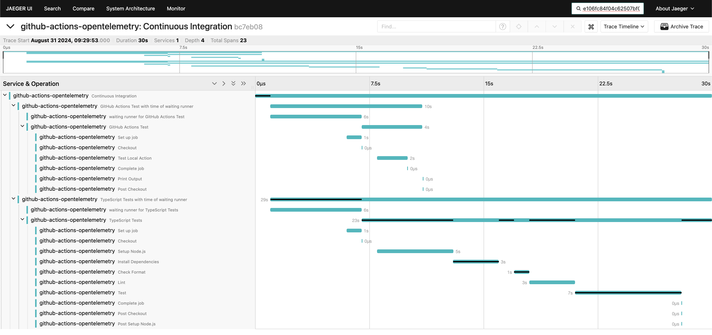

# GitHub Actions OpenTelemetry (Experimental)

[](https://github.com/super-linter/super-linter)

[](https://github.com/actions/typescript-action/actions/workflows/check-dist.yml)
[](https://github.com/actions/typescript-action/actions/workflows/codeql-analysis.yml)
[](./badges/coverage.svg)

This action sends metrics and traces of GitHub Actions to an OpenTelemetry
endpoint (OTLP). It helps you monitor and analyze GitHub Actions.

## Features Summary

- 📊 Collects Metrics of GitHub Actions workflows and job execution times
- 🔍 Collects Traces of GitHub Actions workflow, jobs, steps.
- 📦 Sends data to any OTLP-compatible backend for monitoring and observability
- 🚀 Easy integration with GitHub workflows

## Limitations

- Metric and attribute names may undergo breaking changes due to the
  experimental status.

## Metrics

| Descriptor Name               | Description          |
| ----------------------------- | -------------------- |
| `cicd.pipeline.duration`      | Duration of workflow |
| `cicd.pipeline.task.duration` | Duration of job      |

Each metric has associated attributes.


## Traces



## Setup Instructions

1. **Create OTLP Endpoint**: Set up an OTLP backend to receive telemetry data
   (e.g., Jaeger, Prometheus, or other monitoring tools).
1. **Add a Workflow**: Create a new workflow file and use this action triggered
   by
   [workflow_run](https://docs.github.com/en/actions/writing-workflows/choosing-when-your-workflow-runs/events-that-trigger-workflows#workflow_run)
   because this action collects telemetry of completed workflows.

### GitHub Actions Example

Here's an example of how to set up this action in a GitHub Actions workflow:

```yaml
name: Send Telemetry after Other Workflow

on:
  workflow_run:
    workflows:
      - Check Transpiled JavaScript
      - Continuous Integration
      - CodeQL
      - Lint Codebase
    # This action uses completed workflow for making traces and metrics.
    types:
      - completed

permissions:
  # Required for private repositories
  actions: read

jobs:
  send-telemetry:
    name: Send CI Telemetry
    runs-on: ubuntu-latest
    steps:
      - name: Run
        id: run
        uses: paper2/github-actions-opentelemetry@main
        env:
          OTEL_SERVICE_NAME: github-actions-opentelemetry
          OTEL_EXPORTER_OTLP_ENDPOINT: https://collector-example.com
          # Additional OTLP headers. Useful for OTLP authentication.
          # e.g.
          # New Relic: api-key=YOUR_NEWRELIC_API_KEY
          OTEL_EXPORTER_OTLP_HEADERS:
            api-key=${ secrets.API_KEY },other-config-value=value
        with:
          # Required for collecting workflow data
          GITHUB_TOKEN: ${{ secrets.GITHUB_TOKEN }}
```

### Configuration

To configure the action, you need to set the following environment variables:

| Environment Variable                  | Required | Default Value | Description                                                                                      |
| ------------------------------------- | -------- | ------------- | ------------------------------------------------------------------------------------------------ |
| `OTEL_SERVICE_NAME`                   | Yes      | -             | Service name.                                                                                    |
| `OTEL_EXPORTER_OTLP_ENDPOINT`         | No       | -             | OTLP Endpoint for Traces and Metrics. e.g., <https://collector-example.com>                      |
| `OTEL_EXPORTER_OTLP_HEADERS`          | No       | -             | Additional OTLP headers. Useful for authentication. e.g., "api-key=key,other-config-value=value" |
| `OTEL_EXPORTER_OTLP_METRICS_ENDPOINT` | No       | -             | OTLP Endpoint for Metrics instead of OTEL_EXPORTER_OTLP_ENDPOINT.                                |
| `OTEL_EXPORTER_OTLP_TRACES_ENDPOINT`  | No       | -             | OTLP Endpoint for Traces instead of OTEL_EXPORTER_OTLP_ENDPOINT.                                 |
| `FEATURE_TRACE`                       | No       | `true`        | Enable trace feature.                                                                            |
| `FEATURE_METRICS`                     | No       | `true`        | Enable Metrics feature.                                                                          |
| `OTEL_LOG_LEVEL`                      | No       | `info`        | Log level.                                                                                       |

## Development

### Dev Container

You can run containers by
[devcontainer](https://code.visualstudio.com/docs/devcontainers/containers).

- Jaeger and Prometheus run for local testing.
  - Jaeger: <http://localhost:16686>
  - Prometheus: <http://localhost:9090>

### Local test

You can run all tests below command.

```sh
npm run test
```

You can run a simple test. It is useful for checking output while developing.

```sh
npm run test-local
```

### Recommend to install GitHub CLI (gh)

Tests invoke real GitHub API. Unauthenticated users are subject to strict API
rate limits. If `gh` command is installed and login is finished, token is
automatically set for tests by `vitest.config.ts`.

the login command is below.

```sh
gh auth login
```

If you face below error, recommend to install GitHub CLI and login.

```text
message: "API rate limit exceeded for xx.xx.xx.xx. (But here's the good news: Authenticated requests get a higher rate limit. Check out the documentation for more details.)",
documentation_url: 'https://docs.github.com/rest/overview/resources-in-the-rest-api#rate-limiting'
```

### Default Environment Variables for Testing

Some environment variables are set on `vitest.config.ts`.

## License

This project is licensed under the MIT License. See the [LICENSE](./LICENSE)
file for details.

## Contributing

Contributions are welcome! Please fork the repository and submit a pull request.
Before contributing, ensure that your changes are well-documented and tested.

## Support

If you encounter any issues or have questions, feel free to open an issue in the
repository. We will do our best to assist you promptly.
