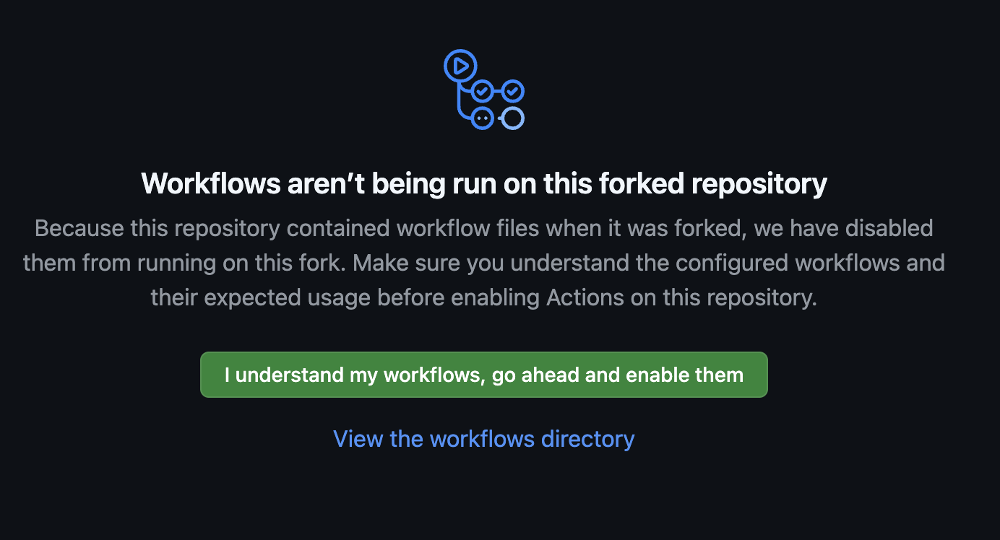
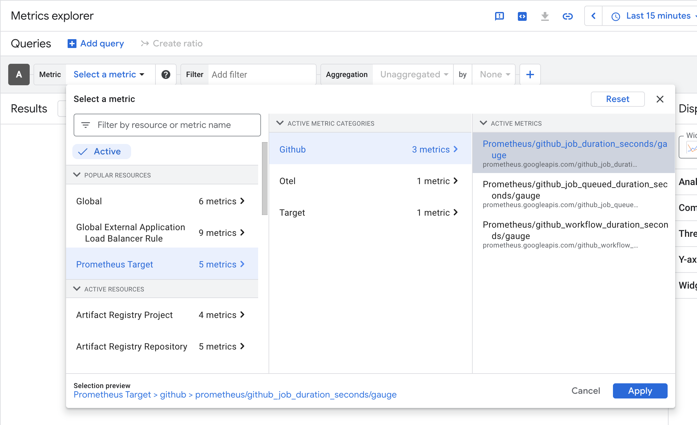

# Getting Started on Google Cloud

This Getting Started guide explains how to deploy an OpenTelemetry Collector on
Google Cloud’s Cloud Run and use github-actions-opentelemetry to send traces and
metrics from GitHub Actions workflows to Google Cloud via the OpenTelemetry
Protocol (OTLP).

> [!IMPORTANT]  
> github-actions-opentelemetry works with any OTLP endpoint. It can also be used
> outside of Google Cloud.

## Prerequisites

- A Google Cloud project
- The gcloud CLI installed
- A GitHub account

## Configure default gcloud settings

1. Set the default project:

   ```sh
   gcloud config set project <PROJECT_ID>
   ```

   `<PROJECT_ID>` is your Google Cloud project ID.

2. Set the default region:

   ```sh
   gcloud config set run/region <REGION>
   ```

   `<REGION>` is your Cloud Run region (for example, `asia-northeast1`).

## Fork the GitHub Actions OpenTelemetry repository

To run the sample GitHub Actions workflow, fork the
[github-actions-opentelemetry](https://github.com/paper2/github-actions-opentelemetry)
repository.


## Clone the sample code

Clone the sample code locally and move into the directory:

```sh
git clone https://<YOUR_FORKED_REPOSITORY>
cd github-actions-opentelemetry/examples/google-cloud
```

## Deploy the OpenTelemetry Collector to Cloud Run

```sh
gcloud run deploy collector \
  --source . \
  --allow-unauthenticated \
  --port=4318 \
  --max-instances=3
```

> [!NOTE]  
> In a production environment, it is recommended not to allow unauthenticated
> access to Cloud Run.

The command above uses the [Dockerfile](./Dockerfile) to build a container and
deploy the OpenTelemetry Collector to Cloud Run. It is based on the
[Contrib repository for the OpenTelemetry Collector](https://github.com/open-telemetry/opentelemetry-collector-contrib),
using [collector-config.yaml](./collector-config.yaml) as the configuration
file.

The configuration file is set up to receive telemetry via OTLP, then forward it
to Cloud Trace and Cloud Monitoring. This means you now have a collector that
accepts OTLP.

## Set the OTLP endpoint

Run this command to retrieve the Cloud Run endpoint of the OpenTelemetry
Collector:

```sh
gcloud run services describe collector --format 'value(status.url)'
```

Add the retrieved endpoint to your
[repository secrets](https://docs.github.com/en/actions/security-for-github-actions/security-guides/using-secrets-in-github-actions#creating-secrets-for-a-repository)
with the key `OTEL_EXPORTER_OTLP_ENDPOINT`.


## Enable workflow runs

Open the Actions tab in your repository. You should see a message asking if you
want to enable workflows. Review them and enable.



## Run the workflow

Create and push a branch named `getting-started`:

```sh
git switch -c getting-started
git commit --allow-empty -m "empty commit"
git push --set-upstream origin getting-started
```

Check the workflow run in the Actions tab. Once the
[Example Workflow](../../.github/workflows/example-workflow-01.yml) completes
successfully, the
[Send Telemetry after Other Workflow Example](../../.github/workflows/example-run-action.yml)
will run, where github-actions-opentelemetry sends traces and metrics via OTLP
to the endpoint.

After confirming success, commit again to observe changes in the metrics:

```sh
git commit --allow-empty -m "empty commit"
git push
```

The
[Send Telemetry after Other Workflow Example](../../.github/workflows/example-run-action.yml)
looks like this:

```yaml
name: Send Telemetry after Other Workflow Example

on:
  workflow_run:
    # Specify the workflows you want to collect telemetry from.
    workflows:
      - Example Workflow 01
      - Example Workflow 02
      - Example Workflow 03
    types:
      - completed

permissions:
  # Required for private repositories
  actions: read

jobs:
  send-telemetry:
    name: Send CI Telemetry
    runs-on: ubuntu-latest
    steps:
      - name: Run
        id: run
        uses: paper2/github-actions-opentelemetry@main
        env:
          OTEL_EXPORTER_OTLP_ENDPOINT:
            ${{ secrets.OTEL_EXPORTER_OTLP_ENDPOINT }}
          OTEL_SERVICE_NAME: github-actions-opentelemetry
        with:
          GITHUB_TOKEN: ${{ secrets.GITHUB_TOKEN }}
```

When any of the specified workflows complete, the `workflow_run` trigger runs
this job. github-actions-opentelemetry gathers the completed workflow details
and sends the traces and metrics to the OTLP endpoint.

## Check Cloud Trace for traces

Obtain the `run_id` for Example Workflow 01. This `run_id` appears in the URL of
the workflow’s results.

For example, in the URL below, the `run_id` is `13388380812`:

```txt
https://github.com/paper2/github-actions-opentelemetry/actions/runs/13388380812
```

Open the [Trace Explorer](https://console.cloud.google.com/traces/explorer) and
filter by `run_id`.


Select the Span ID link to view detailed trace information.


## Check Cloud Monitoring for metrics

Open the
[Metrics Explorer](https://console.cloud.google.com/monitoring/metrics-explorer)
and select the metric `prometheus/github_job_duration_seconds/gauge`.



In the Aggregation settings, choose `workflow_name` and `job_name` to view
execution times by workflow and by job.


## Clean up

Delete the Cloud Run service for the collector:

```sh
gcloud run services delete collector
```

Unset the default gcloud configuration:

```sh
gcloud config unset project
gcloud config unset run/region
```

Finally, delete the forked repository.
